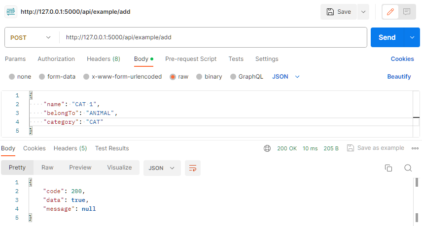
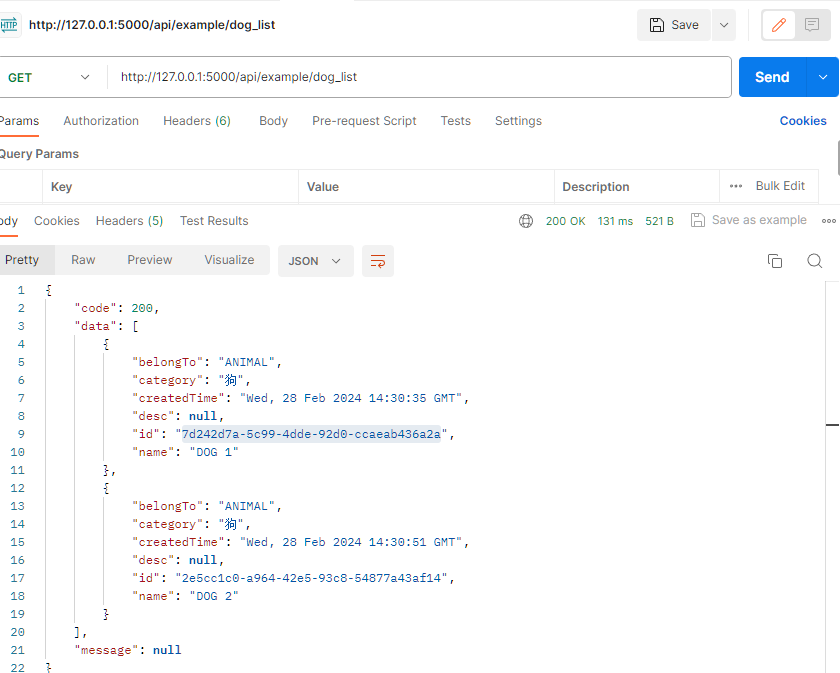
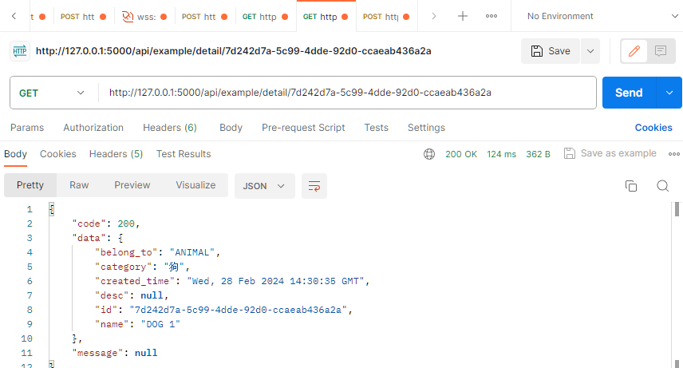
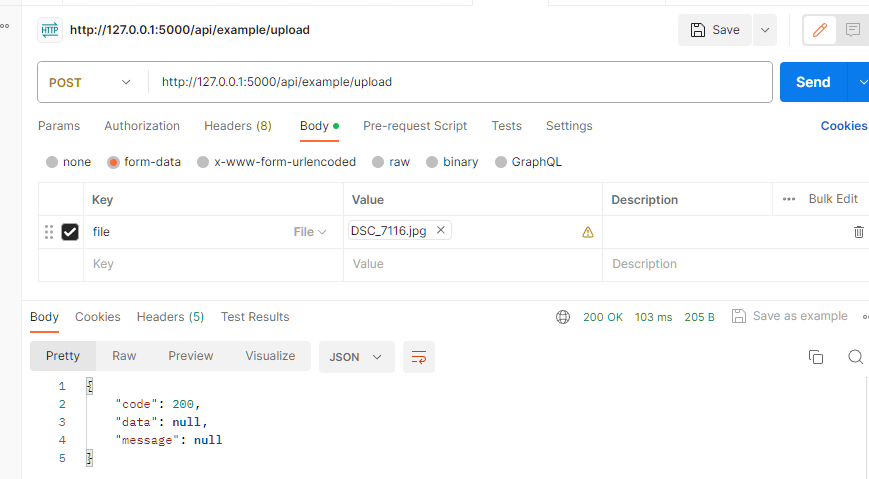

# python web 后端规范框架

### 一、介绍

1. 各个模块之间可以通过依赖注入的方式进行调用，以此实现解耦，使得各个模块可以灵活的独立运行
2. 基于flask框架，建议使用python3.10+开发
3. 使用poetry作为包管理工具
4. 使用dependency-injection作为依赖注入工具
5. 使用pydantic作为数据验证工具
6. 使用sqlalchemy作为数据库操作工具
7. 使用minio作为文件存储工具
8. 蓝图以_blueprint结尾、并处于blueprint目录下，将自动注册
9. 使用model规范数据时，将自动转换驼峰命名为下划线命名
10. 使用model_dumps规范数据时，将自动转换下划线命名为驼峰命名
11. 数据库基于pgsql开发（通过工作单元（UnitOfWork）实现报错自动回滚）

### 二、通过本项目，你将学到
概括
```markdown
1.企业级的python web api开发规范
2.企业级的python web api开发流程
```
细分
```markdown
1. 依赖注入
2. 数据验证
3. 数据库操作
4. 文件存储
5. python的安装
6. poetry的安装
7. postgresql的安装
8. minio的安装
9. pycharm下的项目的配置
10. pgAdmin4下的数据库的配置
    ...
```

### 三、说明

目前为初版，后续将更新如下功能

```markdown
1. 完善数据库基类操作（删除、更新、分页等）
2. 完善文件存储基类操作（上传、下载、删除等）
3. 添加celery作为异步任务工具
4. 添加redis作为缓存工具
5. 添加定时任务工具
   ...
```

### 四、快速开始

[QUICK START](./QUICK_START.MD)

### 五、目录结构

```markdown
app: flask相关
basic: 基础模块
other_module1: 其他模块1
other_module2: 其他模块2
...
config: 配置
.env: 环境变量
run.py: flask app 启动入口
```

### 六、每个模块下的目录结构

```markdown
blueprint: 蓝图 -> 路由
service: 服务类 -> 业务逻辑
repository: 数据库操作 -> 数据库操作
entity: 实体类 -> 数据库表
model: 模型类 -> 数据验证
query_param: 查询参数模型 -> 查询参数验证
utils: 工具 -> 工具
tests: 测试 -> 测试
xxx_controller: 容器 -> 以容器入切入口，实现依赖注入
```

### 七、效果展示

数据库添加数据

数据库获取数据

数据库获取数据

上传文件至minio

